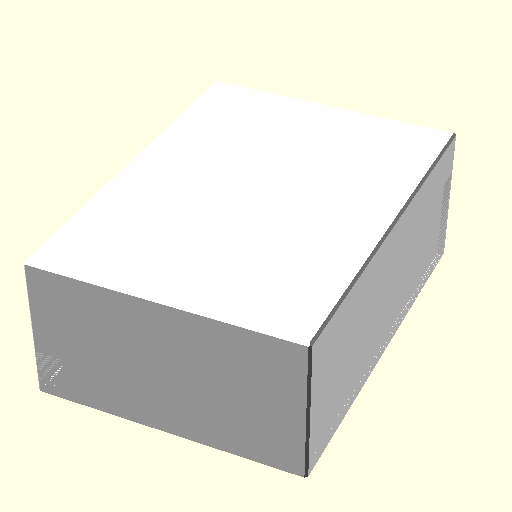

# IKEA-MOSSLANDA-Lamp

## Intro
I built this lighting circuit based on [ESPHome](https://esphome.io/).


## Case
This case will fit straight into the space of the shelves.



Download [STL file](./generated/Case.stl)

Download [3MF file](./generated/Case.3mf)

## Code

```yaml
esphome:
  name: esphome-web-6c5620
  friendly_name: Bedlight

esp32:
  board: nodemcu-32s
  framework:
    type: arduino


# Enable Home Assistant API
api:
  encryption:
    key: "REDACTED"

ota:


wifi:
  ssid: !secret wifi_ssid
  password: !secret wifi_password

  # Enable fallback hotspot (captive portal) in case wifi connection fails
  ap:
    ssid: "Esphome-Web-6C5620"
    password: "MVhqiJclCtY1"

captive_portal:

binary_sensor:
  - platform: gpio
    name: Button Bedlight
    pin:
      number: GPIO22
      mode:
        input: true
        pullup: true
    id: switch_1
    disabled_by_default: True
    on_press:
    - light.toggle: nightlight
  - platform: gpio
    name: Button RGB
    pin:
      number: GPIO23
      mode:
        input: true
        pullup: true
    id: switch_2
    disabled_by_default: True
    on_press:
    - light.toggle: ledstrip

sensor:
  - platform: rotary_encoder
    id: rgb_encoder
    name: "Rotary Encoder RGB"
    pin_b: 
      number: GPIO25
      mode:
        input: true
        pullup: true
    pin_a: 
      number: GPIO26
      mode:
        input: true
        pullup: true
    disabled_by_default: True
    min_value: 0
    max_value: 100
    resolution: 4
    on_value:
      then:
        - light.turn_on:
            id: ledstrip
            brightness: !lambda "return (id(rgb_encoder).state / 100);"
    
  - platform: rotary_encoder
    id: nightlight_encoder
    name: "Rotary Encoder Bedlight"
    pin_b: 
      number: GPIO32
      mode:
        input: true
        pullup: true
    pin_a: 
      number: GPIO33
      mode:
        input: true
        pullup: true
    disabled_by_default: True
    min_value: 0
    max_value: 100
    resolution: 4
    on_value:
      then:
        - light.turn_on:
            id: nightlight
            brightness: !lambda "return (id(nightlight_encoder).state / 100);"


light:
  - platform: monochromatic
    name: Bedlight
    id: nightlight
    output: output_white_pwm    

  - platform: neopixelbus
    variant: SK6812
    pin: GPIO04
    num_leds: 30
    type: GRBW
    name: RGB
    id: ledstrip
    power_supply: relay_rgb
    effects:
      # Use default parameters:
      - random:
      # Customize parameters
      - random:
          name: "My Slow Random Effect"
          transition_length: 30s
          update_interval: 30s
      - random:
          name: "My Fast Random Effect"
          transition_length: 4s
          update_interval: 5s
      - strobe:
      - flicker:
      - addressable_rainbow:
      - addressable_color_wipe:
      - addressable_scan:
      - addressable_twinkle:
      - addressable_random_twinkle:
      - addressable_fireworks:
      - addressable_flicker:
# Example output entry
output:
  - platform: ledc
    id: output_white_pwm
    pin: GPIO02
    power_supply: relay_white
    inverted: true


power_supply:
  - id: relay_white
    keep_on_time: 200ms
    pin:
      number: GPIO27
      inverted: true
  - id: relay_rgb
    keep_on_time: 200ms
    pin:
      number: GPIO13
      inverted: true      
```